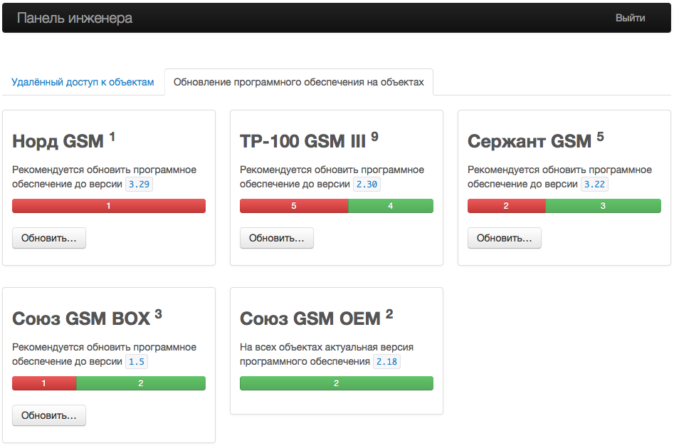
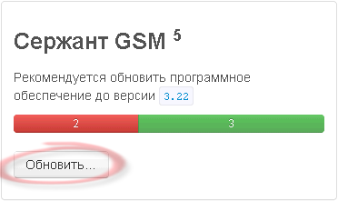
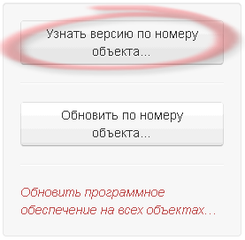
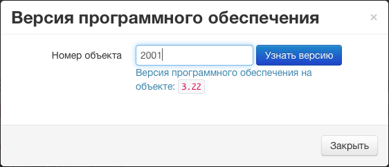

# Как узнать версию программного обеспечения, установленного на приборе?

Если есть возможность подключить прибор к компьютеру, то версию программного обеспечения, которое на нем установлено, можно увидеть в утилите, предназначенной для локального обновления программного обеспечения.

Если же прибор установлен на объекте, то версию программного обеспечения, которое на на нем установлено, можно посмотреть в web-приложении «Панель инженера». Для этого необходимо сделать следующее:

* открыть приложение [«Панель инженера»](https://keyboard.cnord.net)
* авторизоваться в приложении от имени инженера, имеющего разрешение на обновление программного обеспечения на объектах
* перейти на вкладку «Обновление программного обеспечения на объектах»

* нажать на кнопку «Обновить» в блоке, соответствующем типу прибора, установленного на объекте

* нажать на кнопку «Узнать версию по номеру объекта»

* указать номер объекта, на котором установлен прибор и нажать на кнопку «Узнать версию».

